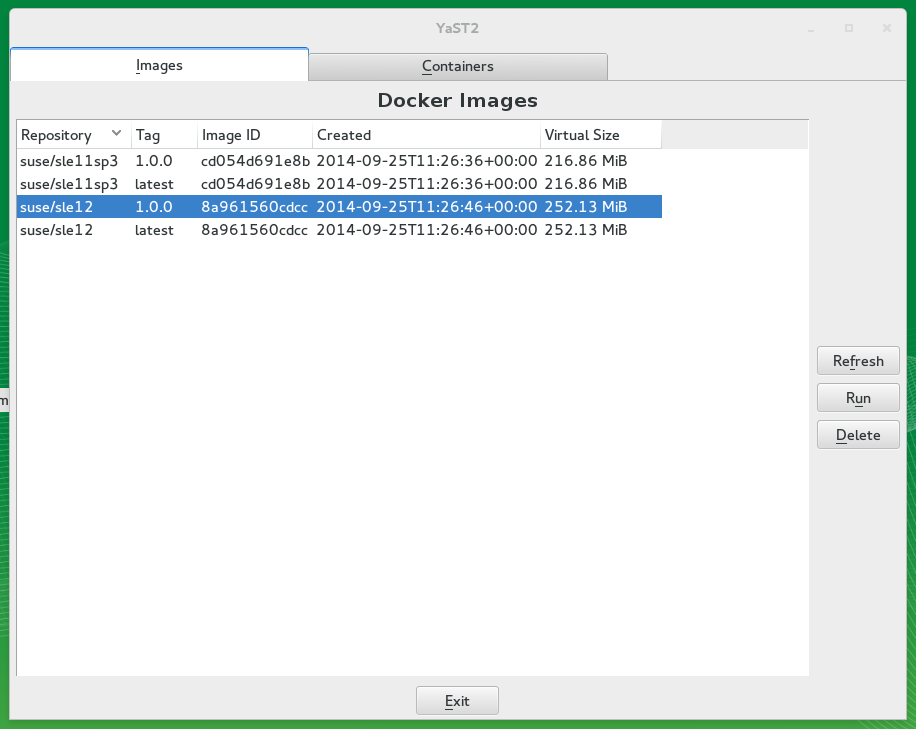
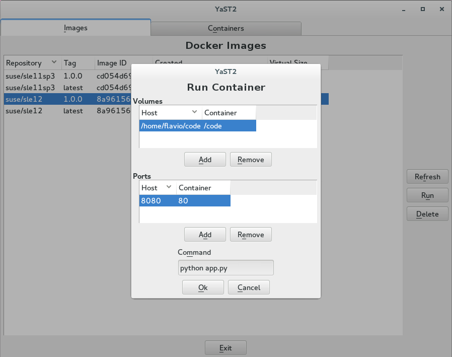

# YaST Docker Module

This module provides access to a running Docker daemon running on the server.

## Features

The module provides the following features:

  * List Docker images available on the system.
  * Delete Docker images from the system.
  * Start Docker containers.
  * List Docker container running on the system.
  * Stop a running Docker container.
  * Kill a running Docker container.
  * Show changes made to a running Docker container compared to its original
    image.
  * Inject a shell into a running container.
  * Commit a running Docker container.

## The images tab

This section of the module lists all the Docker images available on the system.

  

### Start containers

Docker containers can be started by selecting an image from this tab and pressing
the *"Run"* button.

The run dialog allows to specify the following options:

  * Share a volume between the Docker host and the container.
    Details about this Docker feature can be found inside of the [official documentation](https://docs.docker.com/userguide/dockervolumes/#mount-a-host-directory-as-a-data-volume).
  * Map services listining inside of the container to the public network.
    Details about this Docker feature can be found inside of the [official documentation](https://docs.docker.com/installation/mac/#container-port-redirection).

  

## Code status

